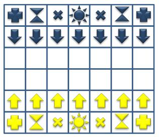

# Talabia Chess

A chess game with a twist, where: After 2 turns (counting one yellow move and one blue move as one turn), all Time pieces will turn into Plus pieces, and all Plus pieces will turn into Time pieces.

## TO-DO

| Task                                | Assignee                                                                       | Due    |
| ----------------------------------- | ------------------------------------------------------------------------------ | ------ |
| Render each piece on board ✅       | [Sally](https://github.com/SALLYKZX)                                           | 15 Jan |
| Board notation ✅                   | [Rony](https://github.com/ronylee11)                                           | 18 Jan |
| Piece logic                         | [GuangYu](https://github.com/BaiterYu0101), [Chia](https://github.com/chia-zx) | 21 Jan |
| Swap Time and Plus each Round       | [Jihin](https://github.com/AUJIHIN)                                            | 23 Jan |
| End Game (Detect CheckMate)         | [Rony](https://github.com/ronylee11)                                           | 26 Jan |
| Customize Board (Finishing touches) | [Rony](https://github.com/ronylee11)                                           | 26 Jan |

Testers: [Sally](https://github.com/SALLYKZX), [Jihin](https://github.com/AUJIHIN)
